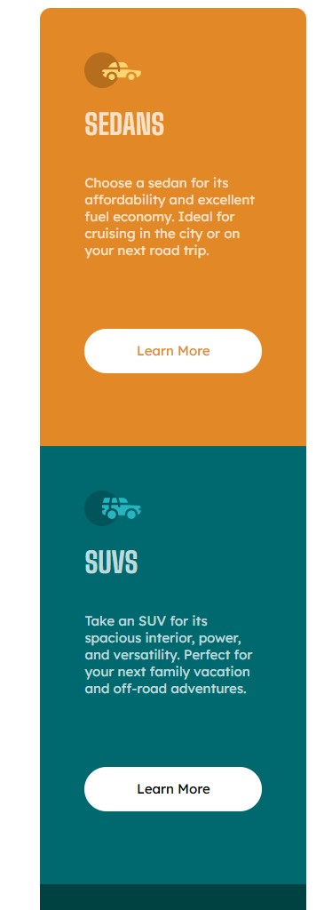

# Frontend Mentor - 3-column preview card component solution

This is a solution to the [3-column preview card component challenge on Frontend Mentor](https://www.frontendmentor.io/challenges/3column-preview-card-component-pH92eAR2-). Frontend Mentor challenges help you improve your coding skills by building realistic projects. 

## Table of contents

- [Overview](#overview)
  - [The challenge](#the-challenge)
  - [Screenshot](#screenshot)
  - [Links](#links)
- [My process](#my-process)
  - [Built with](#built-with)
  - [What I learned](#what-i-learned)
  - [Continued development](#continued-development)
  - [Useful resources](#useful-resources)
- [Author](#author)
- [Acknowledgments](#acknowledgments)

**Note: Delete this note and update the table of contents based on what sections you keep.**

## Overview

### The challenge

Users should be able to:

- View the optimal layout depending on their device's screen size
- See hover states for interactive elements

### Screenshot




## My process
I first began implementing the layout with grid, setting up my grid columns and then styling each of the columns. I did what I could to utilize the cascade and reuse as many styles as I could.

### Built with

- Semantic HTML5 markup
- CSS custom properties
- Flexbox
- CSS Grid
- Mobile-first workflow

### What I learned

```css
.grid-container {
    display: grid;
    grid-template-columns: 1fr; /* mobile-first: 1 column */
    color: var(--color-neutral-transparent-white);
    padding: 1rem;
    max-width: 60%;
}

@media (min-width: 700px) {
    .grid-container {
        grid-template-columns: repeat(3, 1fr); /* 3 columns on desktop */
    }
}
```
This is how I set up my grid for a mobile-first development, utilizing a media query to change around the number of columns depending on the screen size. I am becoming more comfortable with flexbox and grid layouts as well as using media queries to manipulate them into creating a responsive design. 

### Continued development

I will continue using flexbox and grid in use cases that I see fit for each. I will continue to take a mobile-first approach when developing ensuring responsive design is kept in mind. 
