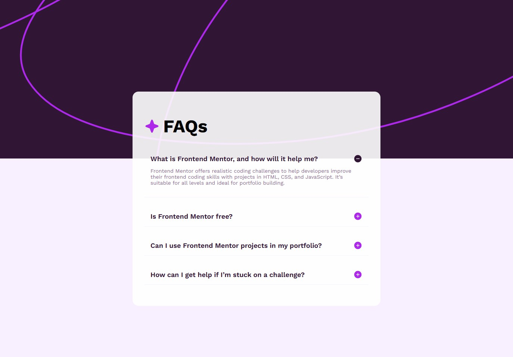

# Frontend Mentor - FAQ accordion solution

This is a solution to the [FAQ accordion challenge on Frontend Mentor](https://www.frontendmentor.io/challenges/faq-accordion-wyfFdeBwBz). Frontend Mentor challenges help you improve your coding skills by building realistic projects. 

## Table of contents

- [Overview](#overview)
  - [The challenge](#the-challenge)
  - [Screenshot](#screenshot)
- [My process](#my-process)
  - [Built with](#built-with)
  - [What I learned](#what-i-learned)
  - [Useful resources](#useful-resources)

## Overview

### The challenge

Users should be able to:

- Hide/Show the answer to a question when the question is clicked
- Navigate the questions and hide/show answers using keyboard navigation alone
- View the optimal layout for the interface depending on their device's screen size
- See hover and focus states for all interactive elements on the page

### Screenshot

## My process

### Built with

- Semantic HTML5 markup
- CSS custom properties
- Flexbox

### What I learned

1. Semantic HTML Structure
    - Used 
 and 
 tags for FAQ sections to provide built-in functionaly and interactivity.
    - Wrapped related items in containerse (e.g., .faq-container) for easier styling and organization. 
2. CSS Layout with Flexbox
    - Used display: flex on parent containers to align child elements horizontally and vertically. 
    - Flexbox helps align icons and text inline with easy vertical centering (align-items: center) and spacing (gap).
3. Background Images & Viewport Units
    - CSS Properties:
        - background-image to set the image
        - background-size: cover to make it fully cover the element's area
        - background-position: to control image alignment
    - Use viewport height units (VH) to size containers relative to the visible screen height (e.g., height: 50vh) for half the screen height.
    - Use wrappers with width: 100vw to stretch backgrounds full page width, separate from narrower content containers.
        - Note sure if overflow: hidden works with this.
4. Customizing Native HTML Elements
    - Added custom icon svgs with CSS pseudo-elements (::before)
5. Accessability and Usability
    - The 
 element allows keyboard users to toggle FAQ items easily.
    - Keep clickable elements (summary) visually clear with cursor changes (cursor: pointer).

### Useful resources

- [MDN HTML Elements Reference](https://developer.mozilla.org/en-US/docs/Web/HTML/Element) - Covers all semantic HTML elements with examples and accessibility notes.

- [freeCodeCamp: Semantic HTML Explained](https://www.freecodecamp.org/news/semantic-html5-elements/) - Breaks down the purpose and usage of semantic tags like `<main>`, `<article>`, and `<aside>` in a beginner-friendly way.

- [CSS Tricks Flexbox Guide](https://css-tricks.com/snippets/css/a-guide-to-flexbox/) - A visual, comprehensive guide to Flexbox with diagrams and property explanations.

- [Flexbox Froggy](https://flexboxfroggy.com/) - A fun, interactive game that helps you practice Flexbox layout properties in a hands-on way.

- [MDN Viewport Units](https://developer.mozilla.org/en-US/docs/Web/CSS/length#viewport-relative-lengths) - Explains how viewport-relative units like `vh`, `vw`, and `vmin` work with simple examples.

- [Smashing Magazine: Fluid Typography with Viewport Units](https://www.smashingmagazine.com/2016/05/fluid-typography/) - Shows how to use `vw` units for responsive typography in a practical, modern way.

- [MDN `::before` and `::after`](https://developer.mozilla.org/en-US/docs/Web/CSS/::before) - Explains how pseudo-elements work, with syntax examples and use cases.

- [CSS Tricks Pseudo-Element Roundup](https://css-tricks.com/pseudo-element-roundup/) - A collection of creative, real-world examples for using `::before` and `::after` in CSS design.
