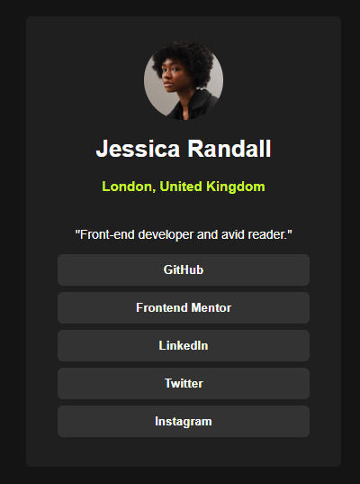

# Frontend Mentor - Social links profile solution

This is a solution to the [Social links profile challenge on Frontend Mentor](https://www.frontendmentor.io/challenges/social-links-profile-UG32l9m6dQ). Frontend Mentor challenges help you improve your coding skills by building realistic projects. 

## Table of contents

- [Overview](#overview)
  - [The challenge](#the-challenge)
  - [Screenshot](#screenshot)
- [My process](#my-process)
  - [Built with](#built-with)
  - [What I learned](#what-i-learned)
  - [Continued development](#continued-development)
  - [Useful resources](#useful-resources)

## Overview

### The challenge

Users should be able to:

- See hover and focus states for all interactive elements on the page

### Screenshot




## My process
What is working for me is adding all of the HTML elements and working at the CSS over time. Having the elements already in place helps me figure out what needs to be put into divs and what needs styled as a group. 

### Built with

- Semantic HTML5 markup
- CSS custom properties


### What I learned

This module was primarily focused on button styling, I had to put them in a block and then add a custom div spacing. The transition of hover was added to the buttons to provide a nice display of what the user is currently hovering on. 

```css
.btn-group button:hover {
    background-color: hsl(75, 94%, 57%);
    color: hsl(0, 0%, 8%);
    font-weight: bold;
}

.divider {
    width: auto;
    height: 7px;
}
```

### Continued development

I'm still not very comfortable with CSS but I am slowly getting there especially with adding fonts, styling text (header tags, paragraph tags, etc). This one took me much less time than the QR code. 

### Useful resources

- [Example resource 1](https://www.w3schools.com/howto/howto_css_button_group.asp) - Button groups.
- [Example resource 2](https://www.w3schools.com/css/css3_buttons.asp) - Used for button hover event.

