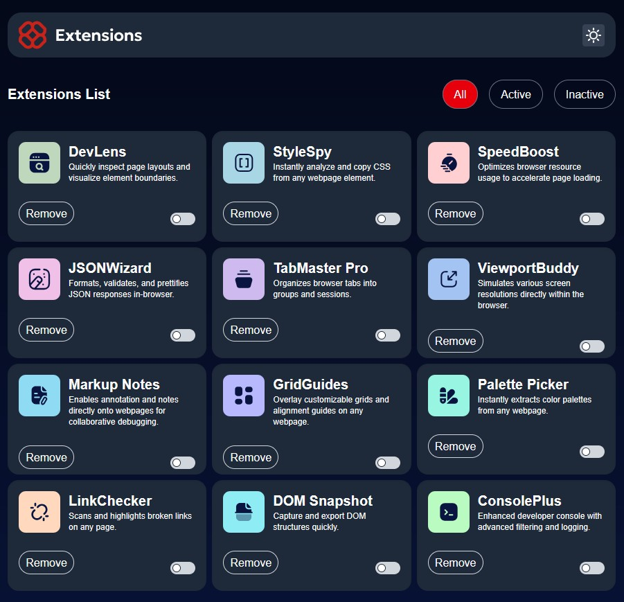
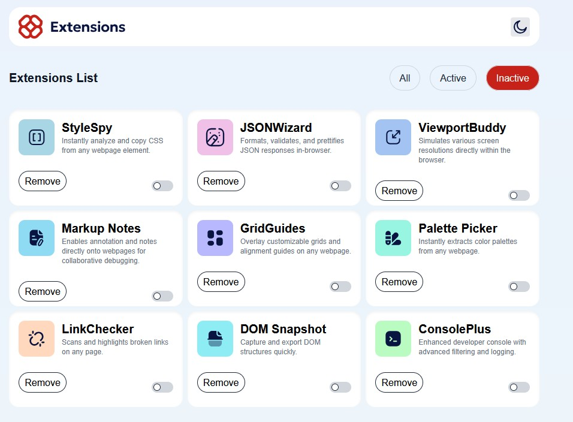
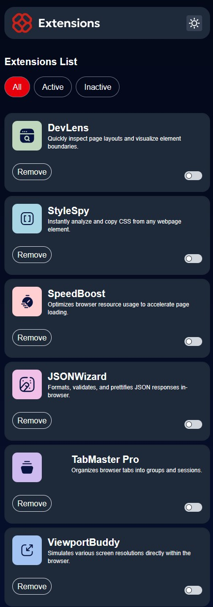
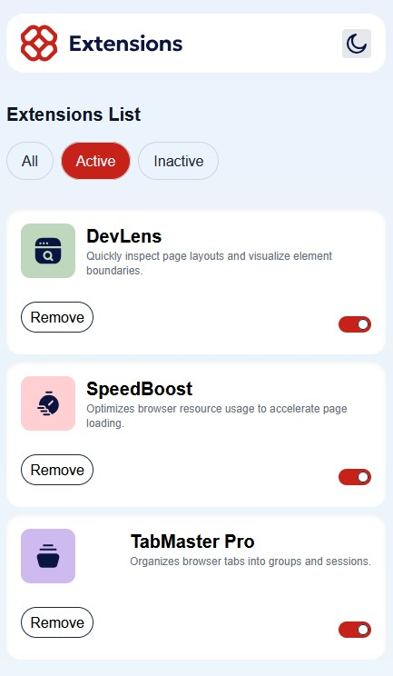

# Frontend Mentor - Browser extensions manager UI solution

This is a solution to the [Browser extensions manager UI challenge on Frontend Mentor](https://www.frontendmentor.io/challenges/browser-extension-manager-ui-yNZnOfsMAp). Frontend Mentor challenges help you improve your coding skills by building realistic projects. 

## Table of contents

- [Overview](#overview)
  - [The challenge](#the-challenge)
  - [Screenshot](#screenshot)
- [My process](#my-process)
  - [Built with](#built-with)
  - [What I learned](#what-i-learned)
  - [Continued development](#continued-development)

## Overview

### The challenge

Users should be able to:

- Toggle extensions between active and inactive states
- Filter active and inactive extensions
- Remove extensions from the list
- Select their color theme
- View the optimal layout for the interface depending on their device's screen size
- See hover and focus states for all interactive elements on the page

### Screenshots






## My process
This was a lengthy process, this was my first time using React and Tailwind in conjunction in a larger project. I first started out by separating my components, getting a basic firewrame done, next came the styling of all of the components. This included the styling and responsiveness of each. Once styling was completed I then moved on to the logic and passing of props between components.

### Built with
- Mobile-first workflow
- [React](https://reactjs.org/) - JS library
- [Tailwind](https://tailwindcss.com/) - Tailwind CSS

### What I learned

- Basic React
- React Hooks
    - UseState
    - UseEffect
- TailwindCSS
- Dark/Light modes

```js
    const getExtensions = async () => {
        try {
            const response = await fetch('http://localhost:3000/extensions');
            const data = await response.json();
            setExtensionList(data);
            const initActive = data.reduce((acc, item) => {
                acc[item.id] = item.active || false;
                return acc;
            }, {});
            setActiveStates(initActive);
        } catch (error) {
            console.error(error);
        }
    }

        useEffect(() => {
        getExtensions();
    }, []);
```
```js
    <div className={`${theme} && "dark" | "light"`}>
      <div className="min-h-screen bg-gradient-to-b from-[#EBF2FC] to-[#EEF8F9] dark:from-[#040918] dark:to-[#091540]">
        <div className=" mx-auto pt-8 pb-8 px-4 sm:px-8 md:px-20 lg:px-30">
          <Header themeHandler={toggleTheme} theme={theme}/>
          <main className="">
            <CardList theme={theme}/>
          </main>
        </div>
      </div>
    </div>
```

### Continued development

From now on starting these Junior challenges I will continue to work with react and tailwind to sharpen my skills and become more comfortable using both. I would like to continue using some new hooks such as useContext to control the dark mode/light mode state instead of passing that state to all components. 