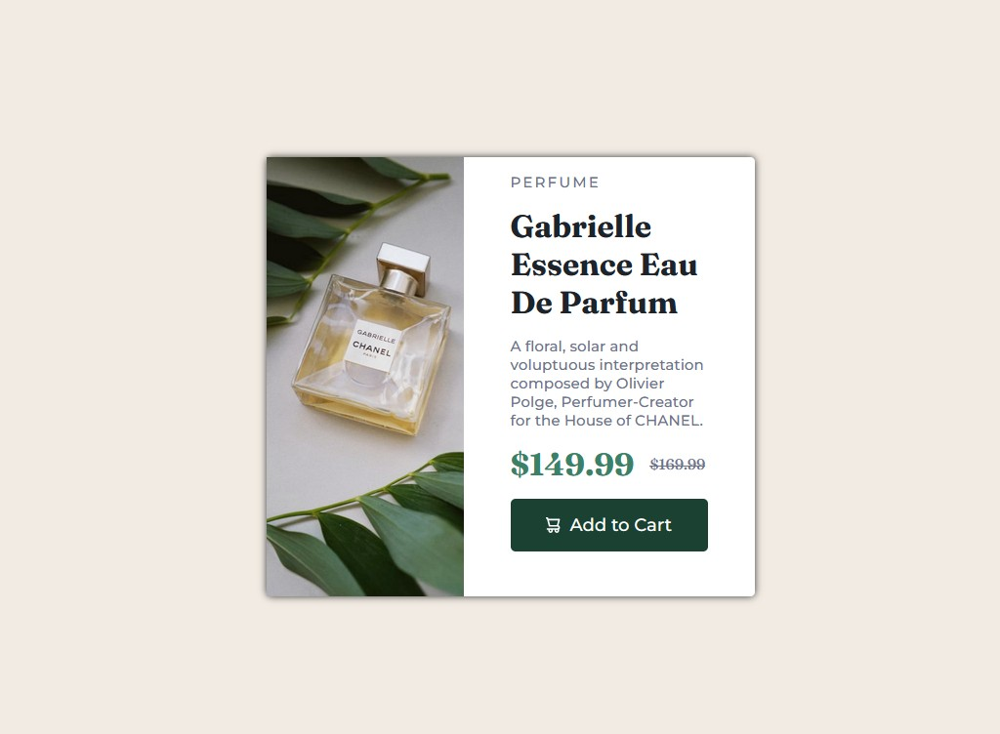

# Frontend Mentor - Product preview card component solution

This is a solution to the [Product preview card component challenge on Frontend Mentor](https://www.frontendmentor.io/challenges/product-preview-card-component-GO7UmttRfa). Frontend Mentor challenges help you improve your coding skills by building realistic projects. 

## Table of contents

- [Overview](#overview)
  - [The challenge](#the-challenge)
  - [Screenshot](#screenshot)
- [My process](#my-process)
  - [Built with](#built-with)
  - [What I learned](#what-i-learned)
  - [Continued development](#continued-development)

## Overview

### The challenge

Users should be able to:

- View the optimal layout depending on their device's screen size
- See hover and focus states for interactive elements

### Screenshot

## My process

Began with creating the containers and getting everything aligned inside of a flex box. This let me see what needed adjusting and where. 

### Built with

- Semantic HTML5 markup
- CSS custom properties
- Flexbox

### What I learned

I am more comfortable with Flexbox now. I was able to successfully utilize it without any headache for the container, image card as well as the description card. Using the gap property as well as the different types of justify-content and align-content make what I have been struggling with trivial.

### Continued development

Start utilizing Grid and figuring out which one works best for my use case. 
Continue utilizing media queries and making my projects more mobile reponsive, that's a weak spot for me right now.