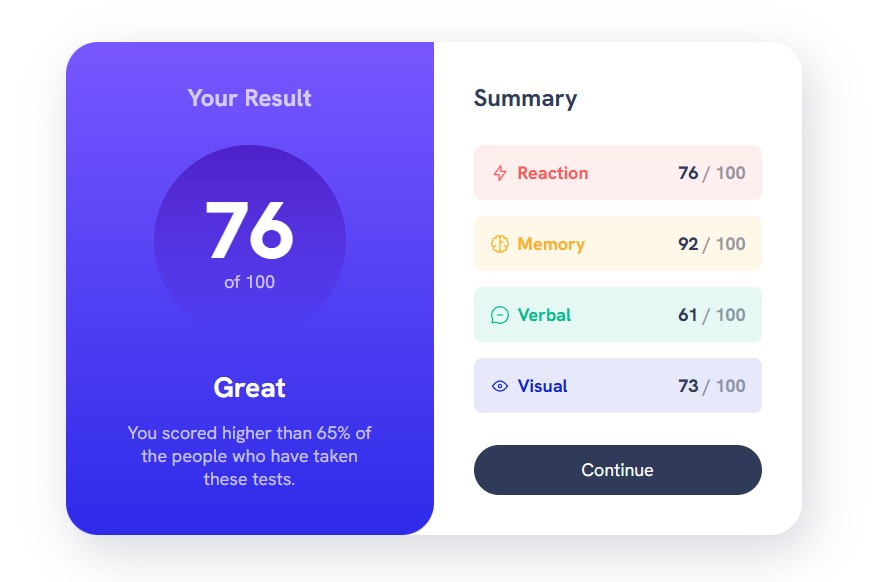

# Frontend Mentor - Results summary component solution

This is a solution to the [Results summary component challenge on Frontend Mentor](https://www.frontendmentor.io/challenges/results-summary-component-CE_K6s0maV). Frontend Mentor challenges help you improve your coding skills by building realistic projects. 

## Table of contents

- [Overview](#overview)
  - [The challenge](#the-challenge)
  - [Screenshot](#screenshot)
- [My process](#my-process)
  - [Built with](#built-with)
  - [What I learned](#what-i-learned)
  - [Continued development](#continued-development)
  - [Useful resources](#useful-resources)

## Overview

### The challenge

Users should be able to:

- View the optimal layout for the interface depending on their device's screen size
- See hover and focus states for all interactive elements on the page
- **Bonus**: Use the local JSON data to dynamically populate the content

### Screenshot



### Built with

- Semantic HTML5 markup
- CSS custom properties
- Flexbox
- CSS Grid

### What I learned

This exercise was a big step in my learning. I utilized both Grid & Flexbox for the different sections. Implemented media queries for the first time to change things based off of the min-width. A big setup that helped me was setting up CSS variables so I didn't have to keep referencing the style-guide.

```css
:root {
  --clr-primary-hsl-400: 252, 100%, 67%;
  --clr-primary-hsl-500: 256, 72%, 46%;
  --clr-secondary-hsl-400: 241, 81%, 54%;
  --clr-secondary-hsl-500: 241, 72%, 46%;

  --clr-neutral-hsl-100: 0, 0%, 100%;
  --clr-neutral-hsl-200: 221, 100%, 96%;
  --clr-neutral-hsl-300: 241, 100%, 89%;
  --clr-neutral-hsl-700: 224, 30%, 27%;

  --clr-neutral-100: hsl(var(--clr-neutral-hsl-100));
  --clr-neutral-200: hsl(var(--clr-neutral-hsl-200));
  --clr-neutral-300: hsl(var(--clr-neutral-hsl-300));
  --clr-neutral-700: hsl(var(--clr-neutral-hsl-700));


  --clr-primary-400: hsl(var(--clr-primary-hsl-400));
  --clr-primary-500: hsla(var(--clr-primary-hsl-500));
  --clr-secondary-400: hsl(var(--clr-secondary-hsl-400));

  --gradient-primary: linear-gradient(
      var(--clr-primary-400), 
      var(--clr-secondary-400));

  --gradient-to-transparent: linear-gradient(
      var(--clr-primary-500),
      hsl(var(--clr-secondary-hsl-500), 0));

  --clr-accent-1: 0, 100%, 67%;
  --clr-accent-2: 39, 100%, 56%;
  --clr-accent-3: 166, 100%, 37%;
  --clr-accent-4: 234, 85%, 45%;

  --font-family-default: 'HankenGrotesk', sans-serif;

  --fw-regular: 500;
  --fw-bold: 700;
  --fw-black: 800;

  --fs-400: 1.125rem;
  --fs-500: 1.25rem;
  --fs-600: 1.5rem;
  --fs-700: 1.75rem;
  --fs-800: 2rem;
  --fs-900: 5rem;
}
```

```css
@media (min-width: 600px) {
    body {
        min-height: 100vh;
        display: grid;
        place-items: center;
    }
}
```

### Continued development

I will continue to build on these foundations and possibly rework some of my older work.

### Useful resources

- [Kevin Powell](https://www.youtube.com/watch?v=KqFAs5d3Yl8&t=555s) - I worked on this project alongside Kevin Powell's video. 
- [Example resource 2](https://www.example.com) - This is an amazing article which helped me finally understand XYZ. I'd recommend it to anyone still learning this concept.
